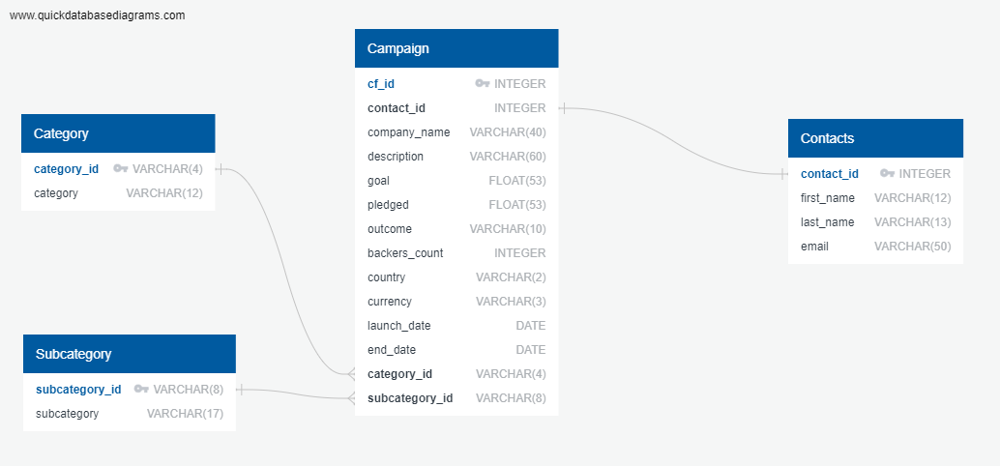

# Crowdfunding_ETL

In this project, we built an Extract, Transform, Load, or ETL, pipeline for provided crowdfunding data. We used Python and Pandas to extract the information from an excel file and transform the data into Pandas dataframes. We then created a SQL schema to load the cleaned information into a PostgresSQL database.

## Extract
The initial data was provided in two separate excel files. We used Python to read the excel files into separate Pandas dataframes for manipulation.

## Transform
Once the data was loaded into dataframes, we transformed the data to make it more useful. This included the following steps:
    - Converting the data type of certain columns
    - Renaming columns
    - Splitting columns into two
    - Dropping columns that were no longer needed
    - Creating "Category" and "Subcategory" dataframes
    - Merging dataframes into existing dataframes

## Load
After transforming was complete, our goal was to load this dataset into a SQL database - a relational database. To do so, we created a ERD in QuickDBD to map out our database and the relationships between each table. This includes the required fields, data types, primary keys, and foreign keys.

Then we used our ERD to create the database schema in SQL and import the final CSVs into the newly created tables.
